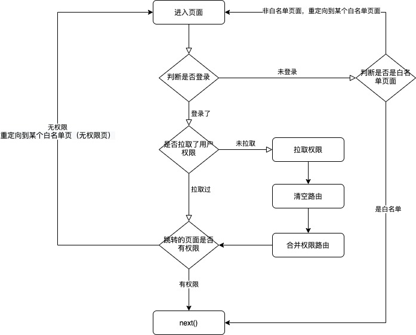

# 文件夹目录
```
.
├── README.md                       readme
├── babel.config.js                 babel配置
├── package-lock.json               锁文件,使用npm,不使用yarn
├── package.json                    项目依赖文件
├── public                          public
│   ├── favicon.ico 
│   └── index.html
├── src                             资源文件
│   ├── App.vue                     App.vue
│   ├── api                         api文件,放所有的网络请求封装
│   │   ├── index.js
│   │   └── readme.md
│   ├── assets                      资源文件,放置文件夹配置
│   │   └── logo.png
│   ├── components                  全局组件,要求文件名/组件名均使用kebab-case命名
│   │   └── readme.md
│   ├── filters                     全局过滤器文件,只需要写过滤器并导出即可
│   │   ├── index.js
│   │   └── readme.md
│   ├── layout                      路由布局组件,预置一个empty组件,基于业务自行添加
│   │   ├── components
│   │   │   ├── szyx-empty
│   │   │   │   ├── logic.js
│   │   │   │   └── szyx-empty.vue
│   │   └── readme.md
│   ├── main.js                     主入口
│   ├── router                      路由组件
│   │   ├── index.js
│   │   ├── modules
│   │   │   └── errorRouter.js
│   │   └── readme.md
│   ├── store                       vuex的store
│   │   ├── getters.js              getters相关
│   │   ├── index.js                主页面
│   │   ├── modules                 分包store
│   │   │   └── exampleStore.js
│   │   └── readme.md
│   ├── styles                      全局style相关
│   │   ├── element-ui.less         全局的element-ui样式变更
│   │   ├── index.less              统一出口
│   │   ├── pallet.less             全局色板变量
│   │   └── readme.md
│   ├── utils                       工具类
│   │   ├── errorHandle.js          全局错误日志(异步型错误捕获不到)
│   │   ├── readme.md
│   │   └── routeHooks.js           路由钩子
│   └── views                       页面相关
│       ├── error-pages
│       │   ├── 404.vue
│       │   └── logic.js
│       ├── home
│       │   ├── index.vue
│       │   └── logic.js
│       ├── readme.md
│       └── redirect
│           └── index.vue
└── vue.config.js                   webpack打包配置
```
# 风格要求
.vue文件:(除App.vue)均使用kebab-case风格
.js文件:使用小驼峰风格

.vue文件中,只包含template与css,js需单独拆分出来
目的是单文件不超过250行.

# 配置相关
## vuex

所有分包store写入

/store/modules

文件夹下

index中引入了所有store,并且要求sotre中需要开始命名空间隔离

调用action的时候,需要加上文件名做前缀

例如:
```
exampleStore中的action:increment
使用时,调用为
store.dispatch('exampleStore/increment')
```

## css相关
使用less预处理框架
├── element-ui.less         全局的element-ui样式变更
├── index.less              统一出口
├── pallet.less             全局色板变量

颜色要求设计提供相应所有颜色,项目中使用到的颜色均使用pallet提供的色板变量

相同的大批量css样式建议考虑[mixins](http://lesscss.cn/features/#mixins-feature)

## router
layout中包含的是页面样式的布局,举个🌰
```
是包含顶部header和页面相关的布局

还是包含左边侧边栏,右边页面相关的布局
```
这些页面样式都属于布局类,可以结合component在此处融合.

默认提供一个空布局(就是啥也没有)

路由钩子见utils中的routeHooks,一般的路由鉴权过程如下,需要自行添加



动态路由使用[addRouter](https://router.vuejs.org/zh/api/#router-addroutes)

## utils

放置大量的工具类

## 一些配置

.eslintrc:eslint相关配置写在了

.vscode:其中放了一些代码块,使用vscode开发的同学可以使用如下快捷方式
```
clg
vue
jsexport
storeexport
```
.vue.config.js:放置了webpack打包相关配置等

开发的proxy也在其中,放开注释修改目标地址即可使用

## vue实例上默认挂载
$API => 指向api中的index
$dayjs => 指向dayjs
$throw => 指向errorHandler

## window默认挂载
dayjs